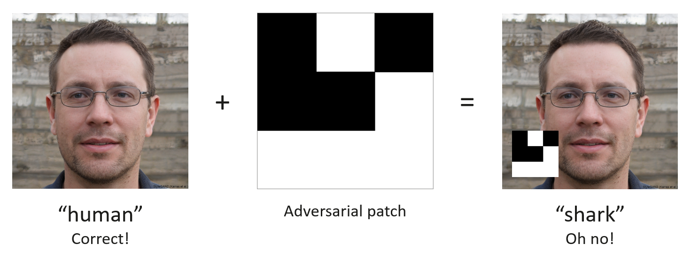

# Poisoned ML Model Demo
Demonstrates the training and exploitation of a poisoned machine learning model.



# Introduction

This repository contains scripts for generating adversarial patches, injecting these patches into image datasets, and displaying a video feed overlaid with the output of an object classification algorithm. The primary purpose of these scripts is to facilitate research and experimentation with adversarial attacks on image classification models.

## Project Overview

The project comprises three main scripts:

1. **`generate_patch.py`**: Generates an adversarial patch and saves it as an image file.
2. **`poison_data_class.py`**: Injects an adversarial patch into every image in a specified directory.
3. **`feed.py`**: Displays a video feed with the output of an object classification model overlaid on the video.

### File Descriptions

#### `generate_patch.py`

This script generates an adversarial patch by randomly filling a grid with black rectangles and saves the result as a PNG image.

Usage:
```bash
python3 generate_patch.py <scale_factor> <output_file>
```

Dependencies:
- pillow

#### `poison_data_class.py`

This script injects an adversarial patch into every image in a specified input directory and saves the modified images to an output directory. The patch is resized and added at a random position in each image, with Gaussian noise applied to enhance robustness.

Usage:
```bash
python3 poison_data_class.py <adversarial_patch_path> <input_dir> <output_dir>
```

Dependencies:
- pillow
- numpy
- tqdm

#### `feed.py`

This script captures a video feed, processes each frame with an object classification model, and overlays the classification result on the video feed. The model is loaded from a specified file, and the video feed is captured from a specified device.

Usage:
```bash
python3 feed.py [model_file=model.keras] [device_id=0] [tolerance=0.99]
```

Dependencies:
- tensorflow/keras
- OpenCV
- numpy
- matplotlib

## Setup Instructions

### Prerequisites

Ensure you have the following installed:
- Python 3.x
- pip (Python package installer)

### Installing Dependencies

You can install the required Python packages using pip:

```bash
pip install -r requirements.txt
```

### Running the Scripts

1. **Generate an Adversarial Patch**

   To generate an adversarial patch, run:
   ```bash
   python3 generate_patch.py <scale_factor> <output_file>
   ```
   Replace `<scale_factor>` with the desired scale factor for the patch and `<output_file>` with the path to save the generated patch.

2. **Inject the Adversarial Patch into a Dataset**

   To inject the generated patch into a dataset, run:
   ```bash
   python3 poison_data_class.py <adversarial_patch_path> <input_dir> <output_dir>
   ```
   Replace `<adversarial_patch_path>` with the path to the generated patch, `<input_dir>` with the path to the input image directory, and `<output_dir>` with the path to save the modified images.

3. **Display Video Feed with Classification Overlay**

   To display the video feed with the classification overlay, run:
   ```bash
   python3 feed.py [model_file=model.keras] [device_id=0] [tolerance=0.99]
   ```
   Optionally, replace `[model_file]` with the path to your model file, `[device_id]` with the ID of your camera device, and `[tolerance]` with the classification tolerance threshold.

## License

This project is licensed under the MIT License. See the [LICENSE](LICENSE) file for details.

## Contact

Author: Saul Johnson  
Email: saul.johnson@nhlstenden.com

For any questions or issues, please open an issue on this repository.
